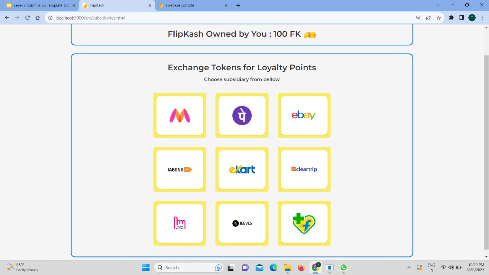
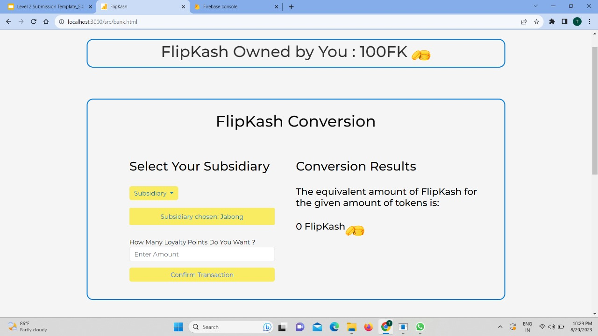
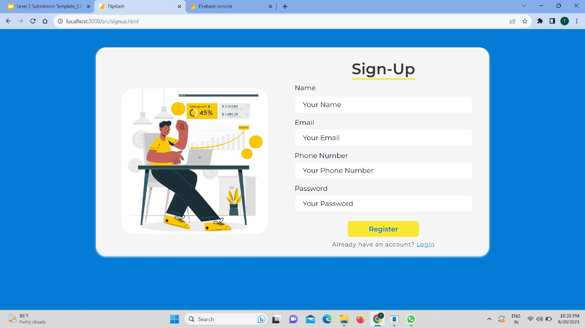

## FlipKash - Fungible Token Based On A Blockchain-Loyalty&Rewards System.
Flipkart Grid 5.0 2023 theme:  Blockchain

### Team members:-
Team Name- ***3Pixel***
1. Chandravo Bhattacharya
2. Tijil Malhotra
3. Avirat Sharma 

## Problem Statement
The objective is to develop a blockchain-enabled loyalty and rewards program for E-commerce
platforms, leveraging the advantages of blockchain technology to enhance security,
transparency, and user engagement.

## Our solution
- An interface that allows ***unified token exchange across Flipkart and its subsidiaries***.***Each subsidiary*** functions as a ***distinct and autonomous node within the blockchain network***. 
- ***Users can exchange tokens for loyalty points from various subsidiaries***, An overview of their owned tokens and loyalty points across diverse Flipkart-owned entities.
- ***Tokens are earned through Flipkart purchases, referrals and social media engagement***. They unlock rewards, including discounts, free shipments, and exclusive perks.
- ***prioritizing eco-friendly products will be rewarded with an augmented token earning***. Additionally, users can ***contribute their tokens to charitable causes***, fostering a culture of giving back.

### Features:-
- ***Blockchain-Based rewards system ensures transparency.***
- Cryptocurrency ***donations to partnered charitable organizations***.
- ***Dynamic Tokenomics*** that promotes circulation as well as long-term growth of the token.
- GUI-Based tool means ***users can use it without prior knowledge of Blockchain**.
- ***Incentive to support eco-friendly products***.
- ***Seamless token exchange to enjoy perks from a wide range of subsidiaries.***

### Blockchain Diagram
  

### Tech-Stack
- Blochain(***Solidity***)
- Frontend: ***HTML, CSS, Vanilla JS, Bootstrap***
- Backend: ***Node.js, ExpressJS***
- Database: ***Firebase***
  
### Instructions:-
- Registration using Sign Up, then Login.
- Exploring the various rewards offered by trading tokens. 
- Viewing the many different subsidiaries Flipkart has.
- Converting tokens to loyalty points to avail rewards.

### Our Implementation
 
 
 
 
